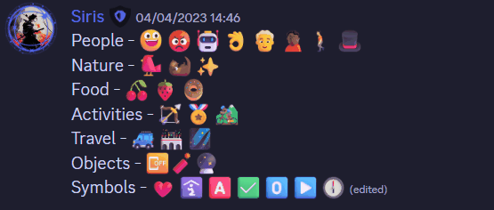

# Discord Fluent

- Make use of css to force discord to use Microsoft fluent emojis instead of the default ones.

## Showcase

<table>
<tr><td>Normal</td><td></td></tr>
<tr><td>Animated</td><td></td></tr>
<tr><td>3D</td><td></td></tr>
<tr><td>Color</td><td></td></tr>
<tr><td>Flat</td><td></td></tr>
<tr><td>High Contrast</td><td></td></tr>
</table>

## How to use

- Use a custom client / patched asar to inject the css into the discord window.
- Choose the required variant from the `css` folder and copy paste the css into your client mod, custom css settings, etc.

- [Userstyles link](https://userstyles.world/style/9144/discord-fluent)

- Alternatively you can make use of css injecting browser extensions like [Stylus](https://github.com/openstyles/stylus)
- [Stylus - Click here to install](https://github.com/Siris01/discord-fluent/raw/main/discord-fluent.user.css) (You may have to enable CSP Patching from Stylus Settings > Advanced)

## Limitations

- Only the emojis in chat and reactions are replaced, not the ones in the emoji picker.
- Visiting a channel with a lof of default emojis may cause the browser/client to freeze for a few seconds.
- Fluent Emojis do not support flags and regional indicators.

## Development

- Clone the repo
- Clone submodules - `git submodule update --init --recursive`
