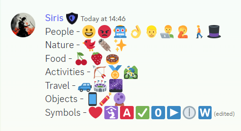
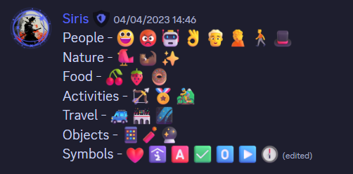
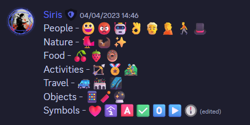
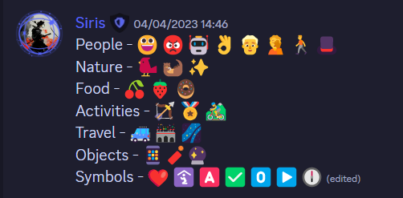

# Discord Fluent

- Make use of css to force discord to use Microsoft fluent emojis instead of the default ones.

## Showcase

- Normal 
- 3D 
- Color 
- Flat 
- High Contrast 

## How to use

- Use a custom client / patched asar to inject the css into the discord window.
- Choose the required variant from the `css` folder and copy paste the css into your client mod, custom css settings, etc.

- [Userstyles link](https://userstyles.world/style/9144/discord-fluent)

- Alternatively you can make use of css injecting browser extensions like [Stylus](https://github.com/openstyles/stylus)
- [Stylus - Click here to install](https://github.com/Siris01/discord-fluent/raw/main/discord-fluent.user.css) (You may have to enable CSP Patching from Stylus Settings > Advanced)

## Limitations

- Only the emojis in chat and reactions are replaced, not the ones in the emoji picker.
- Visiting a channel with a lof of default emojis may cause the browser/client to freeze for a few seconds.
- Fluent Emojis do not support flags and regional indicators.
