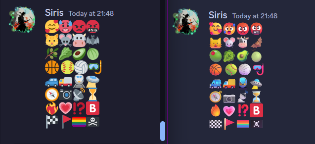

# Discord Fluent

- Make use of css to force discord to use Microsoft fluent emojis instead of the default ones.

## Showcase

## How to use

- Use a custom client / patched asar to inject the css into the discord window.
- Alternatively you can make use of browser css injecting extensions like [Stylus](https://github.com/openstyles/stylus)
- Download the [emojis.css](https://raw.githubusercontent.com/Siris01/discord-fluent/main/emojis.css) file and add it to your extension.

## Limitations

- Only the emojis in chat are replaced, not the ones in the emoji picker.
- Visiting a channel with a lof of default emojis may cause the browser/client to freeze for a few seconds.
- Fluent Emojis do no support flags and regional indicators.
